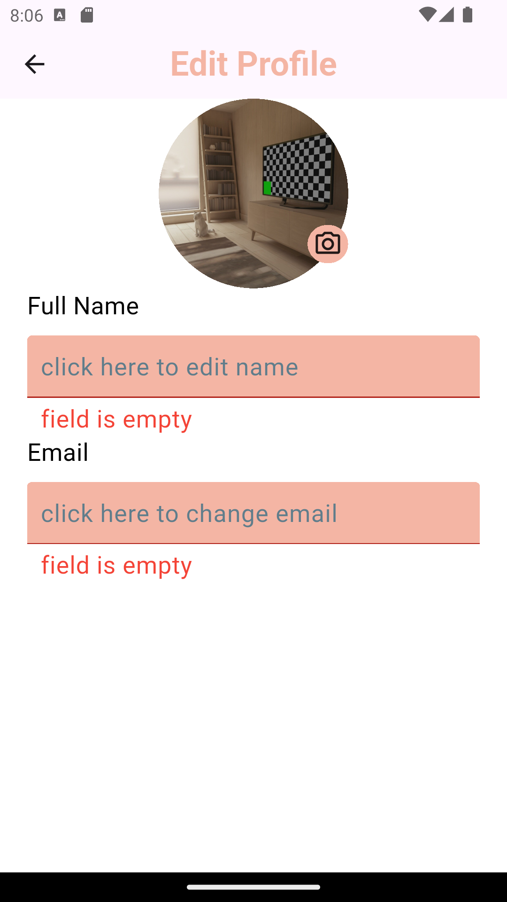
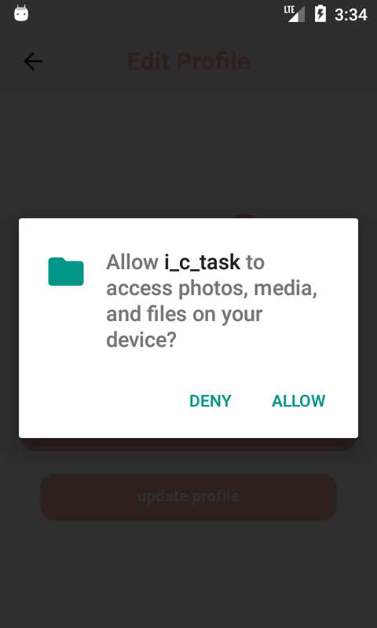

📝 i-c-task App

📌 Description

Flutter app that allows users to store and manage their name, email, and profile picture.

🚀 Features

 • 👤 Profile screen
 • 📦 Orders screen (with static data)
 • 📝 Edit profile screen
 • 💾 Save data using Shared Preferences
 • 📸 Pick images from gallery or camera

🧠 Tech Stack

 • ⚙️ Flutter
 • 🔥 Firebase
 • 🗂️ MVVM + Repository pattern
 • 🧠 GetX (State management + DI + Navigation)
 • 🎯 Shared Preferences
 • 🖼️ Image Picker
 • 📱 Responsive UI

📷 Screenshots

Profile

Edit Profile

Validation Errors

Change Photo

Allow peremssion

Orders Screen

### Note: i use fireStore to storage name and email but i cant use storage from firebase to sotre the pictuer beacouse i have a  problem(not free for me)so i used shared prefs until i'll fix my problem

